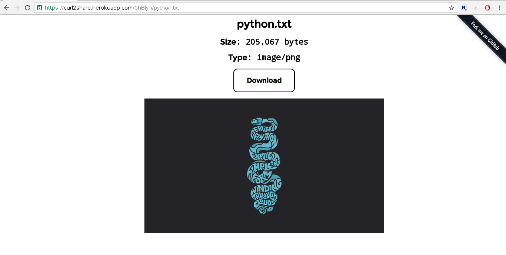

[](https://travis-ci.org/cuongnv23/curl2share)

[](https://heroku.com/deploy?template=https://github.com/cuongnv23/curl2share)

### ABOUT

A simple file sharing app built on [`flask`](https://github.com/pallets/flask).

Made for [`curl`](https://curl.haxx.se/).

Inspired by [`transfer.sh`](https://github.com/dutchcoders/transfer.sh/).

### DEMO

https://curl2share.herokuapp.com

**WARNING**: This page is for demo purpose only and files maybe removed by Heroku.

### INSTALL

This project supports python2 (2.7+) and python3 (3.4+) ~~python2 only, python3 
will be supported soon~~.

Using `virtualenv` is highly recommended to run the project for testing:

- Create your virtualenv
- Clone this repo
- `pip install -r requirements.txt`
- `python run.py`

The app should run on default port `5000`.

### FILE STORAGE

This app is made to support 2 types of storage:

- File system
- S3


You can specify which storage type in `config.py` by changing `STORAGE` value.
File system is the choice by default.

#### File system

The store dir is defined by `UPLOAD_DIR` in `config.py`. Make sure this
directory is writable by this app.

If the directory does not exist, this app will try to create it.

You will also have to update `conf/nginx/file_system.conf` so Nginx can serve
your files directly.

#### S3

Bucket name is defined by `AWS_BUCKET` in `config.py`

This app uses [`boto3`](https://github.com/boto/boto3) to work with S3. 
So configure your credentials by following [this guide](http://boto3.readthedocs.io/en/latest/guide/quickstart.html#configuration)


- You should use a dedicated IAM role for this app, make sure your IAM has write 
access to PUT object to bucket.

- Your bucket must allow Nginx to have access permission to serve files.

Below is a sample policy for bucket:

  ```
  {
        "Version": "2012-10-17",
        "Id": "Policy1470122774736",
        "Statement": [
                {
                    "Sid": "Stmt1470122771419",
                    "Effect": "Allow",
                    "Principal": "*",
                    "Action": "s3:GetObject",
                    "Resource": "arn:aws:s3:::your_bucket/*"
                }
        ]
  }
  ```
- With S3, you can have [redis](https://github.com/antirez/redis) as a caching layer to store information
of file (file size, file type). See `config.py` for details. 
    - By using redis to cache object metadata, you can reduce request ot S3, because in S3, [every request
      counts](https://aws.amazon.com/s3/pricing/).
    - As a caching layer, even if redis server is down, this app should be still up instead of crash. Of course in this
      case metadata will be retrieved from S3.

### DOCKER

The easiest way to get started with `curl2share` is using `Dockerfile`:

```
$ git clone https://github.com/cuongnv23/curl2share.git
$ cd curl2share
$ docker build . --rm -t curl2share
$ docker run --rm -p 5000:5000 -v /tmp/uploads:/tmp/uploads/ curl2share
```

This will run `curl2share` on port 5000 with storage directory is `/tmp/uploads`.


### DOCKER COMPOSE

This app can handle the download itself, but Nginx is a recommendation for this
purpose.

[Nginx](https://github.com/nginx/nginx) is the choice of web server for this 
app from start. Configurations files: `conf/nginx/*`.

[Gunicorn](https://github.com/benoitc/gunicorn) is chosen to be a `wsgi` http 
server. Configuration file: `conf/gunicorn/gunicorn.cfg.py`.

[Docker compose](https://github.com/docker/compose) helps you integrate
Nginx and Gunicorn together as quick and easy way.

`docker-compose` will expose port `8888` for Nginx, make sure this port is available on 
your host.

To use docker compose:

```
$ docker-compose build
$ docker-compose up
```

See `docker-compose.yml` for detail.

#### USAGES 


- Upload file 
```
$ curl --upload-file screen.png https://curl2share.herokuapp.com

https://curl2share.herokuapp.com/Q8DxbG/screen.png
```


- Upload file and rename

```
$ curl --upload-file screen.png https://curl2share.herokuapp.com/python.png

https://curl2share.herokuapp.com/URVXqm/python.png

```


- Detect actual mime type so you're not fooled by (easy-to-be-modified) extension

```
$ curl --upload-file screen.png https://curl2share.herokuapp.com/python.txt

https://curl2share.herokuapp.com/0hBlyn/python.txt

```



- Support upload file with multipart/form-data

```
$ curl -X POST -F file=@screen.png https://curl2share.herokuapp.com

https://curl2share.herokuapp.com/dJQZnc/screen.png
```


### LICENSE

See
[LICENSE](https://github.com/cuongnv23/curl2share/blob/master/LICENSE)
